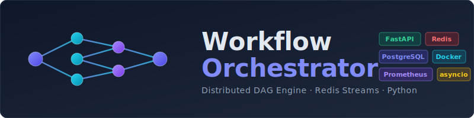

<p align="center">
  
</p>

<p align="center">
  <a href="#quick-start">Quick Start</a> ·
  <a href="#architecture--design-patterns">Architecture</a> ·
  <a href="#system-design">System Design</a> ·
  <a href="#resilience--fault-tolerance">Resilience</a> ·
  <a href="#api-reference">API</a> ·
  <a href="#testing">Testing</a>
</p>

<p align="center">
  
  
  
  
  
  
</p>

---

# Workflow Orchestrator

A production-grade, distributed DAG workflow engine built with **Python**, **FastAPI**, and **Redis Streams**. Designed to demonstrate real-world backend engineering practices — clean architecture, resilience patterns, observability, and horizontal scalability.

> Built from scratch to demonstrate how distributed task execution, fault tolerance, and event-driven architecture work under the hood — a production-ready system designed with scalability and operational excellence in mind.

---

## Tech Stack

| Layer | Technology | Purpose |
|---|---|---|
| **Language** | Python 3.10+ | Async-first with `asyncio` |
| **API** | FastAPI, Pydantic v2 | REST API with automatic OpenAPI docs, request validation |
| **Message Broker** | Redis Streams | Durable, ordered event streaming with consumer groups |
| **Database** | PostgreSQL (asyncpg) | Workflow definitions, execution audit trail |
| **ORM / Migrations** | SQLAlchemy 2.0 (async), Alembic | Async ORM with schema migrations |
| **Observability** | Prometheus, structlog | Metrics endpoint + structured JSON logging |
| **Containerization** | Docker, Docker Compose | Multi-stage builds, health checks, multi-service topology |
| **CI/CD** | GitHub Actions | Lint, test, Docker build + Trivy security scan on every push |
| **Code Quality** | Ruff, pre-commit | Linting, formatting, import sorting |
| **Testing** | pytest, pytest-asyncio, httpx | 231 unit/integration tests, e2e suite, load tests |
| **Dependency Management** | Poetry | Locked, reproducible builds with `poetry.lock` |

---

## Architecture & Design Patterns

### Hexagonal Architecture (Ports & Adapters)

The codebase follows **hexagonal architecture** to enforce separation of concerns and testability. Business logic has zero dependency on frameworks or infrastructure:

```
src/
├── domain/          ← Pure business logic, value objects, entities (no imports from adapters)
│   ├── workflow/    ← DAG, WorkflowDefinition, ExecutionState
│   └── resilience/  ← CircuitBreaker, DeadLetterEntry, ErrorDetail, RateLimitResult
├── ports/           ← Abstract interfaces (secondary ports)
│   └── secondary/   ← MessageBroker, StateStore, DLQRepository protocols
├── adapters/        ← Concrete implementations
│   ├── primary/     ← FastAPI routes (driving adapters)
│   └── secondary/   ← Redis, PostgreSQL, worker handlers (driven adapters)
├── application/     ← Use cases / orchestration logic
└── shared/          ← Cross-cutting: config, logging, metrics, database engine
```

### Key Design Patterns Used

| Pattern | Where | Why |
|---|---|---|
| **Hexagonal / Ports & Adapters** | Entire codebase | Decouple domain from infrastructure; swap Redis for RabbitMQ without touching business logic |
| **Event-Driven Architecture** | Redis Streams consumers | Asynchronous, non-blocking task dispatch and completion handling |
| **Competing Consumers** | Worker + Orchestrator groups | Horizontal scaling — add replicas with zero coordination |
| **Circuit Breaker** | Worker → external services | Fail fast on cascading downstream failures, auto-recover |
| **Dead Letter Queue** | Workers → DLQ stream | Park poison messages; structured error payloads with auto-classification |
| **Saga / Choreography** | Orchestrator completion loop | Each task completion triggers the next, no central coordinator lock |
| **Idempotency** | Redis-based dedup keys | Safe retries — processing the same message twice is a no-op |
| **Value Objects** | DAG, ErrorDetail, RateLimitResult | Immutable, self-validating domain primitives |
| **Repository Pattern** | DLQRepository, StateStore | Abstract persistence behind interfaces |
| **Two-Phase Workflow** | Submit → Trigger | Validate DAG (cold path) separately from execution (hot path) |
| **Graceful Shutdown** | Worker + Orchestrator runners | Drain in-flight tasks on SIGTERM before exiting — zero data loss during deploys |
| **Schema Versioning** | Redis message payloads | Forward-compatible message evolution without breaking consumers |

---

## System Design

<p align="center">
  
</p>

```
 Submission (Cold Path)                          Execution (Hot Path)
 ─────────────────────                          ────────────────────

 Client                                         API
   │                                              │
   ▼                                              ▼
 ┌──────────┐    ┌──────────────┐    ┌─────────────────────────────────────┐
 │ FastAPI   │───▶│ DAG Parser   │───▶│         PostgreSQL                  │
 │ Gateway   │    │ Kahn's O(V+E)│    │   (workflow definitions + state)    │
 └──────────┘    └──────────────┘    └─────────────────────────────────────┘
                                                  │  trigger
                                                  ▼
                 ┌──────────────────────────────────────────────────────┐
                 │                  Redis Streams                       │
                 │         workflow:tasks    workflow:completions       │
                 └────────┬────────┬────────┬──────────▲───────────────┘
                          │        │        │          │
                     consume  consume  consume    completions
                          │        │        │          │
                          ▼        ▼        ▼          │
                     ┌────────┐┌────────┐┌────────┐    │
                     │Worker 1││Worker 2││Worker 3│────┘
                     └───┬────┘└───┬────┘└───┬────┘
                         │         │         │
                    ┌────▼─────────▼─────────▼────┐
                    │  Circuit Breaker  │  Reaper  │
                    │  (fail fast)      │  (XAUTO  │
                    │                   │   CLAIM) │
                    └────────┬──────────┴──────────┘
                             │ max retries exceeded
                             ▼
                    ┌─────────────────────────────┐
                    │     Dead Letter Queue        │
                    │  ErrorDetail · Auto-classify  │
                    └─────────────────────────────┘

 ┌──────────────────┐    ┌────────────────────────────────────────────┐
 │   Orchestrator   │───▶│ Listens for completions, resolves deps,   │
 │   (x2 replicas)  │    │ dispatches next wave of ready tasks       │
 └──────────────────┘    └────────────────────────────────────────────┘
```

- **Cold Path (Submission):** DAG is validated via Kahn's algorithm for cycle detection, topologically sorted, and persisted to PostgreSQL. No execution happens yet.
- **Hot Path (Execution):** Root tasks are published to Redis Streams. Workers consume, execute, and publish completions. Orchestrators listen for completions, resolve dependencies, and dispatch the next wave. This continues until all nodes complete or fail.
- **Why Two Phases?** Decoupling validation from execution allows DAGs to be submitted, reviewed, and triggered independently — matching real-world CI/CD and ML pipeline patterns.

### Container Topology

| Service | Role | Replicas |
|---|---|---|
| `api` | REST API — DAG submission, status queries, DLQ management | 1 |
| `worker` | Task execution — LLM calls, API fetches, conditional logic | 3 |
| `orchestrator` | Dependency resolution — listens for completions, dispatches ready tasks | 2 |
| `reaper` | Zombie recovery — reclaims stuck tasks from Redis PEL via `XAUTOCLAIM` | 1 |
| `redis` | Streams, state store, distributed locks, rate limiter | 1 |
| `postgres` | Workflow definitions and execution audit trail | 1 |

### Message Flow

| Stream | Producers | Consumers | Purpose |
|---|---|---|---|
| `workflow:tasks` | API, Orchestrator | Workers (competing) | Task dispatch |
| `workflow:completions` | Workers | Orchestrators (competing) | Result propagation |
| `workflow:dlq` | Workers | Operators (manual) | Failed task inspection |

---

## Resilience & Fault Tolerance

Five layers of failure recovery ensure the system self-heals without operator intervention:

| Layer | Mechanism | Behaviour |
|---|---|---|
| **1. Idempotency** | Redis `SET NX` dedup keys | Processing the same task twice is a no-op |
| **2. Retry + Backoff** | Exponential backoff with jitter | Transient failures auto-retry with configurable base/max/jitter |
| **3. Circuit Breaker** | Per-handler state machine (closed → open → half-open) | Stops calling a failing downstream after threshold; auto-probes for recovery |
| **4. Dead Letter Queue** | Structured `ErrorDetail` payloads | Tasks exceeding max retries are parked with category, traceback, and timestamp |
| **5. Reaper** | `XAUTOCLAIM` on Redis PEL | Reclaims tasks stuck longer than `REAPER_MIN_IDLE_SECONDS` and re-publishes them |

```
What happens when a worker crashes mid-task:

  1. Task remains in Redis PEL (never ACK'd)
  2. Reaper detects idle time > threshold
  3. XAUTOCLAIM transfers ownership to reaper
  4. Task is re-published to the task stream
  5. A healthy worker picks it up
  6. Idempotency guard prevents duplicate side effects
```

---

## API Reference

### Workflow Endpoints

| Method | Path | Description |
|---|---|---|
| `POST` | `/api/v1/workflow` | Submit a workflow DAG definition |
| `POST` | `/api/v1/workflow/trigger/{execution_id}` | Trigger async execution |
| `GET` | `/api/v1/workflow/{execution_id}` | Get execution status and progress |
| `GET` | `/api/v1/workflow/{execution_id}/results` | Get task results |
| `DELETE` | `/api/v1/workflow/{execution_id}` | Cancel a running execution |

### Admin Endpoints

| Method | Path | Description |
|---|---|---|
| `GET` | `/api/v1/admin/dlq` | List dead letter queue entries with structured errors |
| `POST` | `/api/v1/admin/dlq/{entry_id}/retry` | Retry a failed task from DLQ |
| `DELETE` | `/api/v1/admin/dlq/{entry_id}` | Remove a DLQ entry |

### Operational Endpoints

| Method | Path | Description |
|---|---|---|
| `GET` | `/health` | Health check (Redis + PostgreSQL connectivity) |
| `GET` | `/metrics` | Prometheus metrics (task counts, latencies, circuit breaker states) |
| `GET` | `/docs` | Interactive Swagger UI |

---

## Quick Start

```bash
# 1. Clone
git clone https://github.com/amgad01/workflow-orchestrator.git && cd workflow-orchestrator

# 2. Initialize (Docker, .env, build, migrations, health checks)
bash scripts/init.sh

# 3. Validate — runs cycle detection, parallel execution, resilience, rate limiting
bash scripts/test_api.sh http://localhost:8000
```

### Example Usage

```bash
# Submit a parallel fan-out workflow
curl -s -X POST http://localhost:8000/api/v1/workflow \
  -H "Content-Type: application/json" \
  -d @payloads/parallel_api_fetcher.json | jq .

# Trigger execution
curl -s -X POST http://localhost:8000/api/v1/workflow/trigger/{execution_id} | jq .

# Poll status
curl -s http://localhost:8000/api/v1/workflow/{execution_id} | jq .

# Get results
curl -s http://localhost:8000/api/v1/workflow/{execution_id}/results | jq .
```

---

## Scaling

```bash
# Default: 3 workers, 2 orchestrators
docker compose up -d

# Scale to 30 workers, 5 orchestrators — zero config changes needed
docker compose up -d --scale worker=30 --scale orchestrator=5
```

Redis Streams consumer groups distribute work automatically — no coordinator, no rebalancing protocol, no partition assignment. Adding replicas is a single command.

---

## Testing

```bash
# Unit + integration tests (231 tests)
poetry run pytest tests/ -v -m "not e2e"

# End-to-end tests (requires running stack)
bash scripts/run_e2e.sh

# Load testing
bash scripts/run_load_test.sh http://localhost:8000

# Demo: Reaper + DLQ in action
python scripts/demo_reaper_dlq.py --api-url http://localhost:8000 --watch
```

Test coverage includes: DAG parsing & cycle detection, topological sort correctness, circuit breaker state transitions, DLQ error classification, schema versioning backward compatibility, graceful shutdown draining, idempotency guards, and rate limiting.

---

## Configuration

All settings are centralized in `src/shared/config.py` (Pydantic Settings) and overridable via environment variables or `.env`:

| Group | Key Settings |
|---|---|
| **Database** | `DATABASE_URL`, pool size, max overflow, timeout |
| **Redis** | `REDIS_URL` |
| **Worker** | Batch size, retry count, backoff base/max/jitter, handler timeout |
| **Orchestrator** | Batch size, block time, completion timeout |
| **Reaper** | Check interval, min idle seconds, batch size |
| **Cache** | `DAG_CACHE_MAX_SIZE` (256), `DAG_CACHE_TTL_SECONDS` (300) |
| **Resilience** | Rate limit window/max, circuit breaker threshold/timeout, DLQ max retries |

---

## Development

```bash
# Install dependencies
poetry install

# Start infrastructure only
docker compose up -d redis postgres

# Run API locally with hot reload
uvicorn src.main:app --host 0.0.0.0 --port 8000 --reload

# Run worker and orchestrator
python -m src.worker
python -m src.orchestrator

# Lint + format
ruff check src/ tests/ --fix && ruff format src/ tests/
```

---

## CI/CD Pipeline

Every push triggers a GitHub Actions pipeline with three stages:

1. **Lint & Format** — Ruff check + format verification
2. **Test** — Full test suite against real Redis + PostgreSQL service containers
3. **Docker Build & Security** — Multi-stage image build + Trivy vulnerability scan (fails on HIGH/CRITICAL)

---

## Documentation

| Document | Contents |
|---|---|
| [Architecture](docs/ARCHITECTURE.md) | System design, data flow, component roles |
| [Algorithms](docs/ALGORITHMS.md) | Kahn's cycle detection, distributed locking, template resolution, exponential backoff |
| [Testing & Resilience](docs/TESTING_RESILIENCE.md) | Five-layer failure recovery, test strategies, load testing |
| [Production Readiness](docs/PRODUCTION_READINESS.md) | Deployment checklist, scaling guidelines, monitoring |

---

## System Requirements

- **Docker & Docker Compose** (v2+)
- **Ports**: 8000 (API), 5432 (PostgreSQL), 6379 (Redis)
